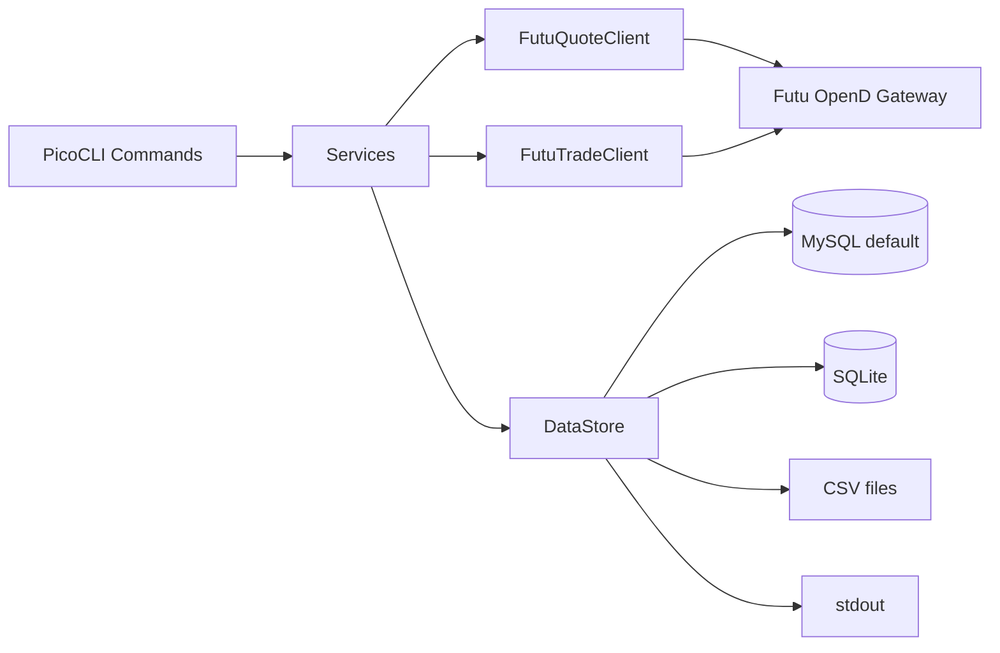

# futu_openD — Project Structure

## Purpose

This is a **Java Maven workspace** for collecting market and trading data from **Futu OpenD** (via the FTAPI4J SDK). The main deliverable is a CLI app (`stock-lab-collector`) that pulls quote and account data and stores it in **MySQL** (default), **SQLite**, **CSV**, or **stdout**.

---

## Top-level layout

```
futu_openD/
├── pom.xml                          # Parent Maven POM (multi-module root)
├── .gitignore
├── doc/
│   └── Futu-API-Doc-zh-Java.md      # Futu API reference (Chinese)
├── FTAPI4J_10.7.6708/               # Vendored Futu OpenAPI Java SDK
│   ├── pom.xml
│   ├── ftapi4j/                     # SDK source (protobuf + API wrappers)
│   ├── sample/                      # Official Futu demo apps
│   ├── lib/                         # Prebuilt JAR location (install to Maven)
│   └── resources/
└── futu_openD_data_collector_cli/   # Main application module
    ├── pom.xml
    ├── README.md
    └── src/main/
        ├── java/com/stocklab/collector/
        └── resources/
            └── config.properties.example
```

---

## Maven modules

| Module | Role |
|--------|------|
| **`futu_openD`** (root) | Parent POM; aggregates one child module |
| **`futu_openD_data_collector_cli`** | Runnable CLI JAR (`stock-lab-collector-1.0.0.jar`) |
| **`FTAPI4J_10.7.6708`** | Third-party SDK (not a Maven submodule; built/installed separately) |

**Tech stack:** Java 8, PicoCLI (CLI), Futu API 10.7.6708, Protobuf, MySQL/SQLite, Maven Shade (fat JAR).

---

## Application architecture (`futu_openD_data_collector_cli`)

```
com.stocklab.collector/
├── Main.java                 # Entry point; registers all subcommands
├── cli/                      # PicoCLI commands (user-facing)
├── client/                   # OpenD connection wrappers
├── service/                  # Business logic (sync, stream, storage orchestration)
├── storage/                  # Persistence backends (Strategy pattern)
├── config/                   # AppConfig, MySqlConfig
└── util/                     # Parsers (symbols, markets, K-line types, etc.)
```

### Layer breakdown

| Package | Files | Responsibility |
|---------|-------|----------------|
| **`cli`** | 18 classes | Commands: `ping`, `snapshot`, `history`, `quote-sync`, `quote-stream`, `subscribe`, `unsubscribe`, `quote-pull`, trade commands (`accounts`, `funds`, `positions`, `orders`), etc. |
| **`client`** | `FutuQuoteClient`, `FutuTradeClient`, `PushListener`, … | Low-level OpenD quote/trade API calls and push callbacks |
| **`service`** | `QuoteHistoricalSyncService`, `QuoteRealtimeService`, `QuoteStorageService`, `QuoteRequestBuilders`, `QuoteApiType` | Orchestrates bulk sync, realtime streaming, and storage |
| **`storage`** | `DataStore` interface + `MySqlStore`, `SqliteStore`, `CsvStore`, `StdoutStore` | Pluggable output; MySQL auto-creates schema |
| **`config`** | `AppConfig`, `MySqlConfig` | Loads `config.properties` + env var overrides |
| **`util`** | `SymbolParser`, `KlTypeParser`, `SubTypeParser`, `TrdMarketParser` | Parses CLI inputs like `HK:00700`, intervals, subscription types |

### CLI package (`cli/`)

| File | Command |
|------|---------|
| `PingCommand.java` | `ping` |
| `SnapshotCommand.java` | `snapshot` |
| `HistoryCommand.java` | `history` |
| `StaticInfoCommand.java` | `static-info` |
| `OrderBookCommand.java` | `orderbook` |
| `SubscribeCommand.java` | `subscribe` |
| `UnsubscribeCommand.java` | `unsubscribe` |
| `QuoteSyncCommand.java` | `quote-sync` |
| `QuoteStreamCommand.java` | `quote-stream` |
| `QuotePullCommand.java` | `quote-pull` |
| `AccountsCommand.java` | `accounts` |
| `FundsCommand.java` | `funds` |
| `PositionsCommand.java` | `positions` |
| `OrdersCommand.java` | `orders` |
| `CommandSupport.java` | Shared CLI helpers |
| `TradeCommandSupport.java` | Trade-specific CLI helpers |
| `GlobalOptions.java` | `--config`, `--format`, `--db` |

### Client package (`client/`)

| File | Role |
|------|------|
| `FutuQuoteClient.java` | Quote API wrapper (pull + push) |
| `FutuTradeClient.java` | Trade API wrapper |
| `PushListener.java` | Callback interface for realtime pushes |
| `FutuApiException.java` | API error type |
| `ConnStatus.java` | Connection state |
| `ReqInfo.java` | Request metadata |

### Service package (`service/`)

| File | Role |
|------|------|
| `QuoteHistoricalSyncService.java` | Bulk historical/fundamental data sync |
| `QuoteRealtimeService.java` | Realtime subscription and streaming |
| `QuoteStorageService.java` | Persists quote responses via `DataStore` |
| `QuoteRequestBuilders.java` | Builds protobuf request objects |
| `QuoteApiType.java` | Enum of supported quote API types |

### Storage package (`storage/`)

| File | Role |
|------|------|
| `DataStore.java` | Persistence interface |
| `MySqlStore.java` | MySQL backend (default) |
| `SqliteStore.java` | SQLite file backend |
| `CsvStore.java` | CSV file backend |
| `StdoutStore.java` | Console output backend |
| `OutputFormat.java` | Format enum |
| `QuoteResponseSerializer.java` | JSON serialization for archive storage |
| `NormalizedQuoteWriter.java` | Writes normalized rows (capital_flow, rehab_factors) |

### Config & util

| File | Role |
|------|------|
| `config/AppConfig.java` | Loads `config.properties` and env overrides |
| `config/MySqlConfig.java` | MySQL connection settings |
| `util/SymbolParser.java` | Parses `MARKET:CODE` symbols |
| `util/KlTypeParser.java` | K-line interval parsing |
| `util/SubTypeParser.java` | Subscription type parsing |
| `util/PlateTypeParser.java` | Plate set type parsing |
| `util/TrdMarketParser.java` | Trade market parsing |

---

## Data flow



1. **CLI** parses args and loads config.
2. **Services** call quote/trade APIs or subscribe to push streams.
3. **Clients** talk to OpenD over TCP (default `127.0.0.1:11111`).
4. **Storage** persists responses (K-lines, snapshots, push ticks, JSON archives, account data).

---

## CLI commands

| Category | Commands |
|----------|----------|
| **Connectivity** | `ping` |
| **Market data** | `snapshot`, `history`, `static-info`, `orderbook` |
| **Bulk / flexible** | `quote-sync` (historical bulk), `quote-stream` (realtime), `quote-pull` (single API), `subscribe`, `unsubscribe` |
| **Trading / account** | `accounts`, `funds`, `positions`, `orders` |

**Global options:** `--config`, `--format` (`mysql` | `sqlite` | `csv` | `stdout`), `--db`

---

## MySQL schema (auto-created)

| Table | Purpose |
|-------|---------|
| `klines` | Historical + realtime K-lines (upsert by symbol/interval/time) |
| `capital_flow` | Normalized fund-flow time series |
| `rehab_factors` | Normalized adjustment factors |
| `quote_api_archive` | All other pull API responses (JSON text) |
| `basic_quotes`, `orderbook`, `realtime_ticks` | Realtime push data |
| `rt_tickers`, `rt_broker_queue` | Tick-by-tick and broker queue pushes |
| `snapshots`, `static_info` | Point-in-time market data |

---

## FTAPI4J SDK (`FTAPI4J_10.7.6708`)

| Subfolder | Contents |
|-----------|----------|
| **`ftapi4j/`** | SDK source: `com.futu.openapi.*` + generated protobuf classes (`pb/`) |
| **`sample/`** | Official demos (quote, trade, MACD strategy, etc.) |
| **`lib/`** | Expected location for `futu-api-10.7.6708.jar` (installed into local Maven repo) |

The collector depends on this JAR as `com.futunn.openapi:futu-api:10.7.6708`.

---

## Configuration

**File:** `config.properties` (copy from `futu_openD_data_collector_cli/src/main/resources/config.properties.example`)

| Key | Description |
|-----|-------------|
| `opend.host` / `opend.port` | OpenD gateway address (default `127.0.0.1:11111`) |
| `user.id` | Futu/Moomoo platform account ID |
| `trd.acc` | Trading account ID |
| `unlock.trade.pwd.md5` | MD5 of trade unlock password |
| `mysql.*` | MySQL connection settings |

**Environment overrides:** `OPEND_HOST`, `OPEND_PORT`, `FUTU_USER_ID`, `FUTU_TRD_ACC`, `FUTU_UNLOCK_MD5`, `MYSQL_HOST`, `MYSQL_PORT`, `MYSQL_DATABASE`, `MYSQL_USER`, `MYSQL_PASSWORD`

---

## Build

```bash
# Build SDK + collector (recommended)
mvn clean install -DskipTests

# Or install prebuilt Futu API JAR (once per machine)
mvn install:install-file \
  -Dfile=FTAPI4J_10.7.6708/lib/futu-api-10.7.6708.jar \
  -DgroupId=com.futunn.openapi \
  -DartifactId=futu-api \
  -Dversion=10.7.6708 \
  -Dpackaging=jar

# Build collector only
mvn package -DskipTests -pl futu_openD_data_collector_cli
```

**Output:** `futu_openD_data_collector_cli/target/stock-lab-collector-1.0.0.jar`

---

## Related docs

- [`README.md`](README.md) — workspace overview and quick start
- [`futu_openD_data_collector_cli/README.md`](futu_openD_data_collector_cli/README.md) — usage and examples
- [`doc/Futu-API-Doc-zh-Java.md`](doc/Futu-API-Doc-zh-Java.md) — Futu API reference (Chinese)
